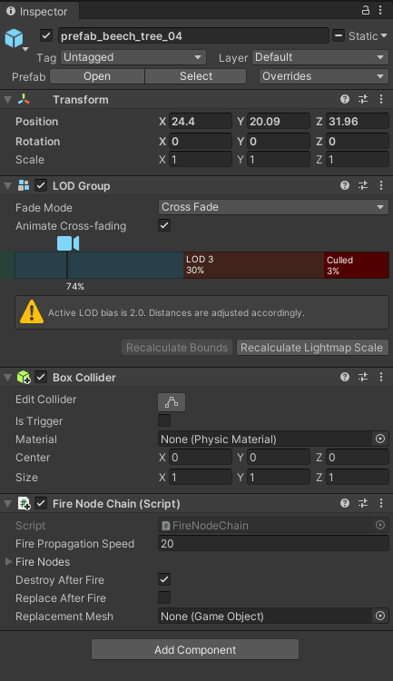

# [Read Me](#read-me)

### Table des Matières

- [Description](#description)
- [Comment utiliser le projet ?](#Comment-utiliser-le-projet-?)
- [References](#references)

---

# Description

Le but du projet est d’une part, de mettre en place un outil de simulation de feu de forêt en utilisant Unity pour avoir les donnees.

Et d’autre part, d’utiliser l’apprentissage profond pour faire des prédictions.

#### Technologies

- Unity verion 2019.3.0f6
- C#

---

# Comment utiliser le projet ?

#### **Installation**

Pour commencer à travailler sur ce projet, crée un nouveau projet sur Unity et importe le package du projet, à télécharger à partir des liens ci-dessous. 

* **Fire Propagationv1.1** : C'est la version la plus stable  
Vous pouvez le télécharger à partir [ici](https://drive.google.com/file/d/15Lh0t7KhX8-TZPmwHdtj3Wcjy4w4LDoG/view?usp=sharing)
* **Realistic Forest** : C'est la version la plus réaliste mais il y a des choses à améliorer 
   * Avant d'ajouter les arbres il faut vérifier si le sol prend feu d'abord 
   * Ajouter les arbres sur le terrain 
   * Contrôler la propagation du feu au niveau du lac et des rivières sur le terrain 
   * Vous pouvez le télécharger à partir [ici](https://drive.google.com/file/d/1qKAxMBDQDOh3ab8zZFJnE4_DcCEKH72A/view?usp=sharing)
 
#### **Description de l'asset**

Dans le dossier asset:

* Fire Propagation : C’est la base du projet. Il contient les dossiers comme Scripts, Scènes, Prefabs
* Nature Manufacture : ce dossier contient différents types d’arbres plus réaliste, des routes et des rochers.
* Fire Effects : Il contient des prefabs sur différents types d’effets de feu et d’explosion 

**La Scène**:
* Forest Terrain contient le prefab FireManager (voire la documentation en anglais)
* Cube : est un Game Object utiliser pour déclencher le feu. 
* SoundManager : Gere l’effet sonore de feu de foret 
* Trees : contient tous les arbres qui sont sur le terrain. 

## Comment changer ou ajouter un nouvel arbre sur le terrain ? 

Apres avoir sélectionné un arbre dans **Nature Manufacture** et le placé sur la scène, il faut ajouter deux components (Box Collider et Fire Node Chain (Script) ) 

Après cela il faut placer les firenodes sur l’arbre pour que ça puisse prendre feu. 
Pour plus de détails voir la scène démo (ForestDemo) dans le dossier FirePropagation dans Scènes. 

## Comment créer les masks pour le training ?

J’ai trouvé plus simple de faire une petite vidéo pour expliquer cela. La vidéo est répertoriée sur Youtube Voici le lien :  https://www.youtube.com/watch?v=Y1Dl8EOxROM

**Les scripts** : 
* ectractImage.py : permet d’extraire tous les frames d’une vidéo
* resize.py : C’est pour resizer la taille des images

**Pour plus de details sur la documentation voir le document Instructions**

---

## References
- Fire Propagation - [@unity Asset Store](https://assetstore.unity.com/packages/tools/fire-propagation-92187)
- Lewis Ward -  [@lewis-ward.com](http://www.lewis-ward.com/unity-fire-propagation-system.html)
  
[Back To The Top](#read-Me)

---

